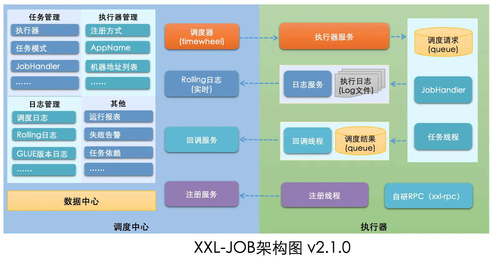
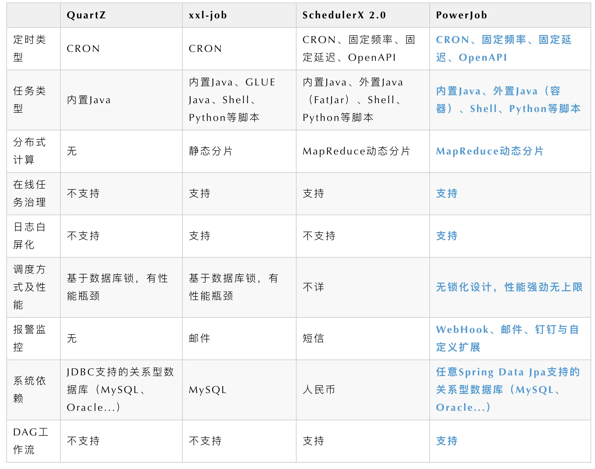

= 定时任务

方式

. jdk Timer
. ScheduledExecutorService
. Spring Task
. Quartz
. Elastic-Job

    是当当网开源的一个基于Quartz和ZooKeeper的分布式调度解决方案，由两个相互独立的子项目 Elastic-Job-Lite 和 Elastic-Job-Cloud 组成，一般我们只要使用 Elastic-Job-Lite 就好。

. XXL-JOB

. PowerJob

对比

== 设计

- 要执行的定时任务使用最小堆排序（根是堆中最小的值）

== 时间轮

简单来说就是一个环形的队列（底层一般基于数组实现），队列中的每一个元素（时间格）都可以存放一个定时任务列表。

假设每一格是 1 秒，要 3 秒后执行，只需要放在第三个格子，超出格数则需要引入圈数

多层次时间轮，多个循环队列，队列的格子间隔一个比一个大，比如：1s, 1m, 1h

时间轮比较适合任务数量比较多的定时任务场景，它的任务写入和执行的时间复杂度都是 0（1）。
